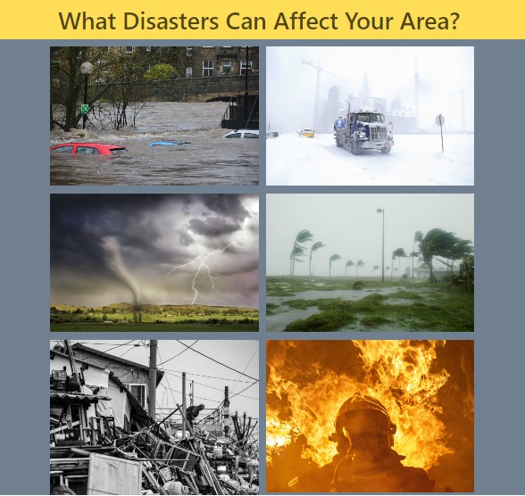

# Responsive Portfolio Using BootStrap

## Description

My Portfolio consists of 3 pages `index.html`, `portfolio.html` and `contact.html` which are built using 
Html, CSS and BootStrap to make it responsive.

## Usage

If you navigate to home page, there are 3 hyperlinks (About, Portfolio and Contact) when clicked which redirects you to 3 different pages.
*Home/About me page consists of my photograph and biodata.
*Portfolio page consists of my work which is yet to be updated.
*Contact page consists of Name, Email and Message where in you can submit your details to contact me.
*There are social media links of my Linkedin profile and Github account on Contact Page.

## Portfolio Projects

1. Work-Day-Scheduler : Simple Calendar application that allows the user to save events for each hour of the day.This app will run in the browser and feature 
   dynamically updated HTML and CSS powered by jQuery.
    
   

   Github Repo Link : https://github.com/ShravaniAllamReddy/Work-Day-Scheduler

2. WeatherForecast-Report : This Application retrieves current and future conditions for selected cities using weather API.

   

   Github Repo Link : https://github.com/ShravaniAllamReddy/WeatherForecast-Report

3. Disaster Ready : This application is designed to compile external data and provide sources to users regarding disaster relief. A sizeable amount of the population is not prepared in the    event of a natural disaster. This product is designed to provide information to users who would like to prepare for natural disasters or those who have been directly affected by natural disasters. Preparation is a key component in order to reduce the impact of the disasters. Even without a disaster preparation plan this site is designed to provide current information regarding news, weather, airquality and other helpful information to users who have been affected by a natural disaster. 

  

  Github Repo Link : https://github.com/aroseca15/Disaster-Ready

## URL for Deployed Application

https://shravaniallamreddy.github.io/